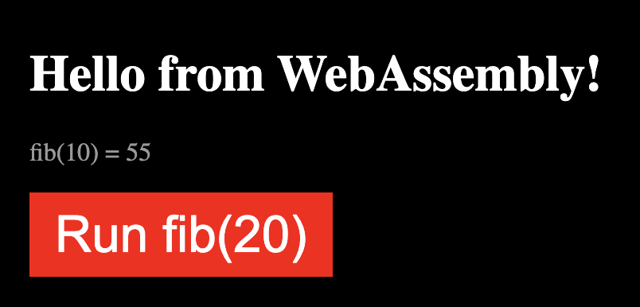
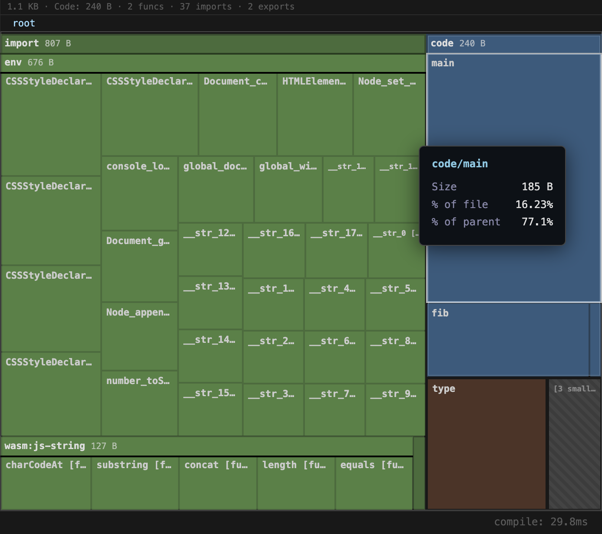

<p align="center">
  
</p>

# ts2wasm Typescript to WebAssembly Compiler

AOT compiler that compiles a strict subset of TypeScript directly to WebAssembly with the GC proposal.

Runs entirely in the browser – no server, no build step for user code.

```
TS Source (String) → tsc Parser+Checker → Codegen → Wasm GC Binary (Uint8Array) → WebAssembly.instantiate()
```

## Why ts2wasm?

TypeScript normally transpiles to JavaScript, which requires a JS engine to run and provides no sandboxing between modules – any module can access globals, the filesystem, the network, or mutate shared state. ts2wasm compiles TypeScript directly to WebAssembly instead, which unlocks features that regular TS/JS does not have:

- **Run untrusted TypeScript safely in-process** – a Wasm module runs in a sandboxed linear memory with no access to the host filesystem, network, or globals unless explicitly imported. No need to spin up a separate isolate or subprocess. This helps limit the blast radius of security vulnerabilities and supply chain attacks.
- **No runtime embedding required** – Run TypeScript in environments without a JS engine like embedded systems, Wasm-only runtimes (wasmtime, wasmer, wazero), or any host that speaks Wasm but not JavaScript. because ts2wasm targets Wasm GC, the engine manages memory and garbage collection natively. There is no runtime, allocator, or standard library bundled into the output. Compiled modules are in the range of a few hundred bytes to a few kilobytes – smaller than what virtually any other language can achieve when compiling to Wasm. This makes tiny ESM style modules practical.
- **No need to think about glue code** – ts2wasm provides a helper function to create bindings for JS and DOM APIs transparently, so you can use them in your TypeScript code without having to adapt your code given you don't use any features that are not supported by ts2wasm. Glue code for JS and DOM APIs is provided once by the host, not per module, Support for the upcoming `wasm:js-string` built-in is already present.

## Example

Here is a regular TypeScript file with 962 bytes that compiles to 1.1kb of WebAssembly:

```ts
export function fib(n: number): number {
  if (n <= 1) return n;
  return fib(n - 1) + fib(n - 2);
}

export function main(): void {
  const app = document.createElement("div");
  app.style.fontFamily = "system-ui, sans-serif";
  app.style.padding = "2rem";

  const h1 = document.createElement("h1");
  h1.textContent = "Hello from WebAssembly!";
  h1.style.color = "white";
  app.appendChild(h1);

  const p = document.createElement("p");
  p.textContent = "fib(10) = " + fib(10).toString();
  p.style.color = "#999";
  app.appendChild(p);

  const btn = document.createElement("button");
  btn.textContent = "Run fib(20)";
  btn.style.padding = "0.5rem 1rem";
  btn.style.fontSize = "2rem";
  btn.style.border = "none";
  btn.style.borderRadius = "10px";
  btn.style.backgroundColor = "red";
  btn.style.color = "#fff";
  app.appendChild(btn);

  document.body.appendChild(app);
  document.body.style.backgroundColor = "black";
  console.log("page ready");
}
```

renders this in the browser:



The module analyzer shows the size of the WebAssembly binary and the WAT text for the compiled module.



## Quickstart

```bash
pnpm install
pnpm test        # 195 tests
pnpm dev         # Start playground
```

## CLI

```bash
ts2wasm input.ts [options]
```

| Option            | Description                               |
| ----------------- | ----------------------------------------- |
| `-o, --out <dir>` | Output directory (default: same as input) |
| `--wat`           | Emit only WAT to stdout                   |
| `--no-wat`        | Skip WAT output                           |
| `--no-dts`        | Skip .d.ts output                         |

Output files: `<name>.wasm`, `<name>.wat`, `<name>.d.ts`, `<name>.imports.js`

## API

```ts
import { compile } from "ts2wasm";

const result = compile(`
  export function add(a: number, b: number): number {
    return a + b;
  }
`);

if (result.success) {
  const imports = {
    env: {
      console_log_number: (v: number) => console.log(v),
      console_log_bool: (v: number) => console.log(!!v),
    },
  };
  const { instance } = await WebAssembly.instantiate(result.binary, imports);
  const exports = instance.exports as any;
  console.log(exports.add(2, 3)); // 5
}
```

### `compile(source, options?): CompileResult`

```ts
interface CompileResult {
  binary: Uint8Array; // Wasm GC binary
  wat: string; // WAT text (debug)
  dts: string; // TypeScript declarations for exports/imports
  importsHelper: string; // JS module with createImports() helper
  success: boolean;
  errors: CompileError[];
  stringPool: string[]; // String literals used in source
}

interface CompileOptions {
  emitWat?: boolean; // default: true
  moduleName?: string;
}
```

### `compileToWat(source): string`

Returns only the WAT text (debug).

## Test262 Conformance

<!-- AUTO:COVERAGE:START -->
### Summary

| Metric | Count |
|--------|------:|
| Total tests | 15,740 |
| Pass | 5,770 |
| Fail | 17 |
| Compile error | 13 |
| Skip | 9,940 |
| **Pass rate (excl. skip)** | **99%** |

### Feature Coverage

| Feature | Status | Pass | Total | Rate |
|---------|--------|-----:|------:|-----:|
| Array methods | 🟢 Full | 195 | 195 | 100% |
| Assignment & destructuring | 🟢 Full | 531 | 531 | 100% |
| Async / Await | 🟢 Full | 163 | 163 | 100% |
| Bitwise operators | 🟢 Full | 130 | 130 | 100% |
| Boolean | 🟢 Full | 21 | 21 | 100% |
| Classes | 🟢 Full | 1048 | 1048 | 100% |
| Collections (Map, Set) | 🟢 Full | 25 | 25 | 100% |
| Comparison operators | 🟢 Full | 187 | 187 | 100% |
| Compound assignment | 🟢 Full | 268 | 268 | 100% |
| Computed property names | 🟢 Full | 12 | 12 | 100% |
| Conditional (ternary) | 🟢 Full | 11 | 11 | 100% |
| Control flow (if, switch, try/catch, break, continue) | 🟢 Full | 274 | 274 | 100% |
| Dynamic import | 🟢 Full | 313 | 313 | 100% |
| Functions | 🟢 Full | 364 | 364 | 100% |
| Generators | 🟢 Full | 66 | 66 | 100% |
| Global functions | 🟢 Full | 94 | 94 | 100% |
| Increment / Decrement | 🟢 Full | 82 | 82 | 100% |
| JSON | 🟢 Full | 34 | 34 | 100% |
| Logical operators | 🟢 Full | 77 | 77 | 100% |
| Loops (for, for-of, for-in, while, do-while) | 🟢 Full | 295 | 295 | 100% |
| new / new.target | 🟢 Full | 9 | 9 | 100% |
| Number built-ins | 🟢 Full | 108 | 108 | 100% |
| Object built-ins | 🟢 Full | 2 | 2 | 100% |
| Object literals | 🟢 Full | 326 | 326 | 100% |
| Optional chaining & nullish coalescing | 🟢 Full | 16 | 16 | 100% |
| Promises | 🟢 Full | 11 | 11 | 100% |
| Rest parameters | 🟢 Full | 3 | 3 | 100% |
| String methods | 🟢 Full | 101 | 101 | 100% |
| super | 🟢 Full | 7 | 7 | 100% |
| Template literals | 🟢 Full | 33 | 33 | 100% |
| typeof / void / delete / in / instanceof | 🟢 Full | 33 | 33 | 100% |
| Types (number, string, boolean, null, undefined) | 🟢 Full | 46 | 46 | 100% |
| Variables (let, const) | 🟢 Full | 90 | 90 | 100% |
| Math methods | 🟢 Full | 528 | 533 | 99% |
| Arithmetic operators | 🟡 Mostly | 202 | 227 | 89% |

**Overall: 5705 / 5735 tests passing (99%)**

### Not Supported

| Feature | Notes |
|---------|-------|
| `var`, `eval`, `with` | Not planned — use `let`/`const` instead |
<!-- AUTO:COVERAGE:END -->

### Benchmarks

<!-- AUTO:BENCHMARKS:START -->
_No benchmark data available. Run benchmarks to populate this section._
<!-- AUTO:BENCHMARKS:END -->

## JS Host Dependencies

Compiled modules currently require a JS host to provide certain imports. The goal is pure Wasm with no JS dependency (see [#682](plan/issues/ready/682.md)), but these host imports remain:

| Category | Imports | Status | Tracking |
|----------|---------|--------|----------|
| **String ops** | `wasm:js-string`, native i16 arrays, or UTF-8 | Three modes: JS host strings, WasmGC i16 arrays (standalone), or UTF-8 i8 arrays (Component Model) | `--nativeStrings` flag |
| **Property access** | `__extern_get`, `__extern_set`, `__extern_length` | Fallback for untyped objects | — |
| **Math** | `Math.*` methods (sin, cos, sqrt, etc.) | Wasm has no math stdlib | — |
| **Console** | `console.log`, `console.warn`, `console.error` | I/O requires host | WASI `fd_write` alt |
| **RegExp** | `RegExp_new`, `.test()`, `.exec()` | Needs Wasm regex engine | [#682](plan/issues/ready/682.md) |
| **Generators** | `__create_generator`, `__gen_next`, etc. | Host-delegated iterator protocol | [#681](plan/issues/ready/681.md) |
| **Iterators** | `__iterator`, `__iterator_next`, `__iterator_done`, `__iterator_value` | Host-delegated iteration | [#681](plan/issues/ready/681.md) |
| **Promises** | `Promise_all`, `Promise_race`, `Promise_new`, `Promise_then`, etc. | Async requires host event loop | — |
| **JSON** | `JSON_stringify`, `JSON_parse` | Needs Wasm JSON parser | — |
| **typeof** | `__typeof` | Runtime type tag for externref | — |
| **parseInt/parseFloat** | `parseInt`, `parseFloat` | String→number parsing | — |
| **Extern classes** | `Map_new`, `Set_new`, `RegExp_new`, `Date_new`, etc. | Constructor delegation | Per-class |
| **Boxing** | `__box_number` | f64→externref conversion | — |

Use `--target wasi` to emit WASI imports (`fd_write`, `proc_exit`) instead of JS host for I/O.
Use `--nativeStrings` to use WasmGC i16 arrays instead of `wasm:js-string`.

## Architecture

```
┌──────────────────────── Browser ─────────────────────────┐
│                                                           │
│  TS Source (String)                                       │
│       │                                                   │
│       ▼                                                   │
│  ┌──────────────────────────────┐                         │
│  │  typescript Compiler API     │                         │
│  │  - createSourceFile (parse)  │                         │
│  │  - createProgram (check)     │                         │
│  │  - TypeChecker               │                         │
│  └──────────────┬───────────────┘                         │
│                 │ Typed AST                               │
│                 ▼                                         │
│  ┌──────────────────────────────┐                         │
│  │  ts2wasm Codegen             │                         │
│  │  - AST → IR                  │                         │
│  │  - IR → Wasm Binary          │                         │
│  │  - IR → WAT Text (debug)     │                         │
│  └──────────────┬───────────────┘                         │
│       ┌─────────┴──────────┐                              │
│       ▼                    ▼                              │
│  Wasm GC Binary       WAT Text                           │
│  (Uint8Array)         (string)                           │
│       │                                                   │
│       ▼                                                   │
│  WebAssembly.instantiate(binary, imports)                 │
└───────────────────────────────────────────────────────────┘
```

## Project Structure

```
ts2wasm/
├── src/
│   ├── index.ts              # Public API: compile(), compileToWat()
│   ├── compiler.ts           # Pipeline: parse → check → codegen → emit
│   ├── cli.ts                # CLI entry point (ts2wasm <input.ts>)
│   ├── import-resolver.ts    # import → declare stub transformation
│   ├── checker/
│   │   ├── index.ts          # tsc integration with in-memory CompilerHost
│   │   └── type-mapper.ts    # ts.Type → WasmType mapping
│   ├── ir/
│   │   ├── index.ts          # Re-exports
│   │   └── types.ts          # WasmModule, Function, Instruction, ValType
│   ├── codegen/
│   │   ├── index.ts          # Typed AST → IR orchestration
│   │   ├── expressions.ts    # Expression → IR instructions
│   │   ├── statements.ts     # Statement → IR instructions
│   │   ├── functions.ts      # Function declarations, optional params
│   │   └── structs.ts        # Interface → GC struct types
│   ├── emit/
│   │   ├── binary.ts         # IR → Wasm binary (Uint8Array)
│   │   ├── encoder.ts        # LEB128, section encoding
│   │   ├── opcodes.ts        # Wasm opcodes incl. GC (0xFB prefix)
│   │   └── wat.ts            # IR → WAT text (debug output)
│   └── runtime/
│       └── builtins.ts       # Runtime functions
├── playground/
│   ├── index.html            # IDE layout: dual editor + output panels
│   ├── main.ts               # Compile, run, file management
│   ├── wasm-treemap.ts       # Binary size treemap visualization
│   └── wasm-treemap.html     # Standalone treemap page
└── tests/
    ├── compiler.test.ts      # End-to-end: TS → binary → execution
    ├── binary.test.ts        # Binary encoder unit tests
    ├── codegen.test.ts       # Codegen unit tests
    ├── equivalence.test.ts   # TS ↔ Wasm output equivalence
    ├── strings.test.ts       # String/externref tests
    ├── arrays-enums.test.ts  # Array + enum tests
    ├── anon-struct.test.ts   # Anonymous object type tests
    ├── control-flow.test.ts  # Control flow edge cases
    ├── externref.test.ts     # External class tests
    ├── optional-params.test.ts
    ├── import-resolver.test.ts
    └── fixtures/             # .ts test fixtures
```

## Codegen Rules

**number → f64 (unboxed)**

```ts
export function add(a: number, b: number): number {
  return a + b;
}
```

```wat
(func $add (export "add") (param f64) (param f64) (result f64)
  local.get 0
  local.get 1
  f64.add
  return)
```

**Interface → GC Struct**

```ts
interface Point {
  x: number;
  y: number;
}
```

```wat
(type $Point (struct (field $x (mut f64)) (field $y (mut f64))))
```

**boolean → i32** (0 = false, 1 = true)

**string → externref** (host-managed via wasm:js-string)

**void → no return value**

## Scripts

| Script            | Description           |
| ----------------- | --------------------- |
| `pnpm build`      | Build library (Vite)  |
| `pnpm dev`        | Playground dev server |
| `pnpm test`       | Run tests (Vitest)    |
| `pnpm test:watch` | Tests in watch mode   |
| `pnpm lint`       | Linting (Biome)       |
| `pnpm typecheck`  | TypeScript check      |

## Toolchain

- **Language:** TypeScript (strict mode)
- **Parser & Type Checker:** `typescript` Compiler API
- **Output:** `Uint8Array` (Wasm binary) + WAT text + `.d.ts` + imports helper
- **Package Manager:** pnpm
- **Bundler:** Vite
- **Test Framework:** Vitest
- **Linting:** Biome

## Sponsor

Looking for a sponsor to support ongoing development. If you're interested, please reach out.

## License

MIT

---

Made with ❤️ by [ttraenkler](https://github.com/ttraenkler) assisted by [Claude Code](https://claude.ai/code).
