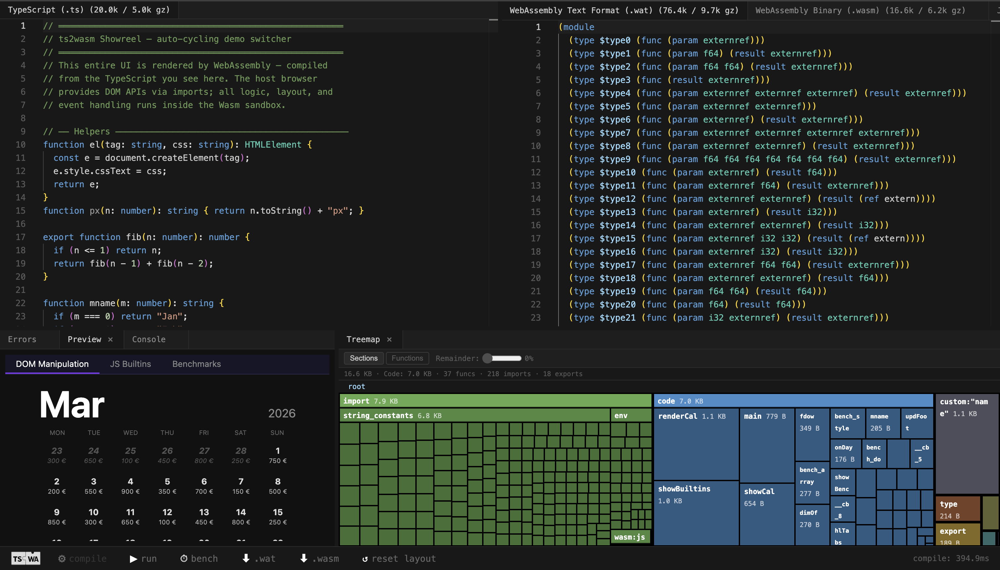

<p align="center">
  
</p>

# js2wasm — TypeScript/JavaScript to WebAssembly Compiler

**Ahead-of-time compiler that compiles JavaScript and TypeScript directly to [WebAssembly GC](https://github.com/nicolo-ribaudo/tc39-proposal-wasm-gc) — no interpreter, no runtime, no vendor lock-in.**

js2wasm produces native WasmGC binaries in the range of hundreds of bytes to a few kilobytes per module. There is no garbage collector, allocator, or standard library bundled into the output — the Wasm engine manages memory natively. This makes it practical to deploy individual ECMAScript modules as sandboxed Wasm components in embedded systems, serverless platforms, and any host that speaks WebAssembly but not JavaScript.

> **17,583 / 43,120** official [test262](https://github.com/tc39/test262) conformance tests passing (40.8%) — up from 550 at project start. See the [live conformance dashboard](https://loopdive.github.io/js2wasm/dashboard/).

## How It Compares

js2wasm takes a fundamentally different approach from other projects in this space. Most tools that run JavaScript in WebAssembly do so by **bundling an interpreter** (QuickJS, SpiderMonkey) inside a Wasm module — the output is megabytes, not bytes, and the JS code is interpreted, not compiled. js2wasm compiles JS/TS directly to native Wasm instructions.

| Project                                                              | Approach                     | WasmGC  | Standalone               | Output size     | Conformance | Status       |
| -------------------------------------------------------------------- | ---------------------------- | ------- | ------------------------ | --------------- | ----------- | ------------ |
| **js2wasm**                                                          | **AOT → WasmGC**             | **Yes** | **Yes (WASI + JS host)** | **~0.1–10 KB**  | **41%**     | **Active**   |
| [Javy](https://github.com/bytecodealliance/javy)                     | QuickJS bundled in Wasm      | No      | WASI only                | 869 KB+ static  | ~99%\*      | Production   |
| [StarlingMonkey](https://github.com/bytecodealliance/StarlingMonkey) | SpiderMonkey bundled in Wasm | No      | No (needs CM host)       | ~8 MB           | ~99%\*      | Production   |
| [Porffor](https://porffor.dev/)                                      | AOT → Wasm (linear memory)   | No      | Yes                      | <100 KB         | ~50%        | Experimental |
| [JAWSM](https://github.com/drogus/jawsm)                             | AOT → WasmGC                 | Yes     | Yes                      | No data         | ~25%        | Dormant      |
| [Static Hermes](https://github.com/facebook/hermes)                  | AOT → native via C           | No      | Yes (bundles runtime)    | Bundles runtime | ~55%        | Experimental |

<sub>\* Javy and StarlingMonkey inherit their embedded engine's conformance — they're not compiling JS to Wasm, they're running an interpreter inside Wasm.</sub>

**Key differentiators:**

- **No runtime overhead** — compiled to native Wasm instructions, not interpreted
- **Tiny output** — hundreds of bytes per function vs. megabytes for interpreter-bundling approaches
- **Standalone deployment** — runs on wasmtime, wasmer, wazero, or any Wasm runtime via `--target wasi`
- **No vendor lock-in** — open source (MIT), no corporate runtime dependency
- **Intra-process sandboxing** — each module runs in isolated Wasm memory with deny-by-default permissions (Object Capabilities)

**[Project Roadmap →](ROADMAP.md)** — vision, achievements, and planned work.

## Why js2wasm?

TypeScript normally transpiles to JavaScript, which requires a JS engine to run and provides no sandboxing between modules. js2wasm compiles TypeScript directly to WebAssembly instead:

- **Run untrusted TypeScript safely in-process** — a Wasm module runs in sandboxed memory with no access to the host filesystem, network, or globals unless explicitly imported. This limits the blast radius of supply chain attacks without spinning up separate isolates.
- **No runtime embedding required** — run TypeScript in environments without a JS engine: embedded systems, Wasm-only runtimes (wasmtime, wasmer, wazero), or any host that speaks Wasm but not JavaScript. The engine manages memory and garbage collection natively via WasmGC.
- **Automatic host bindings** — js2wasm generates import bindings for JS and DOM APIs transparently. Glue code is provided once by the host, not per module. Support for `wasm:js-string` built-ins is already present.

## Quick Start

### Install and run

```bash
pnpm install
npx js2wasm input.ts -o output.wasm
```

### Programmatic API

```ts
import { compile } from "js2wasm";

const result = compile(`
  export function add(a: number, b: number): number {
    return a + b;
  }
`);

if (result.success) {
  const { instance } = await WebAssembly.instantiate(result.binary, imports);
  console.log((instance.exports as any).add(2, 3)); // 5
}
```

### CLI Options

```bash
js2wasm input.ts [options]
```

| Option              | Description                               |
| ------------------- | ----------------------------------------- |
| `-o, --out <dir>`   | Output directory (default: same as input) |
| `--target wasi`     | Emit WASI imports instead of JS host      |
| `--optimize` / `-O` | Run Binaryen wasm-opt on output           |
| `--wit`             | Generate WIT interface (Component Model)  |
| `--nativeStrings`   | Use WasmGC i16 arrays (auto for WASI)     |
| `--wat`             | Emit only WAT to stdout                   |
| `--no-wat`          | Skip WAT output                           |
| `--no-dts`          | Skip .d.ts output                         |

Output files: `<name>.wasm`, `<name>.wat`, `<name>.d.ts`, `<name>.imports.js`

## Example

Idiomatic DOM code compiles directly to Wasm plus a small set of host imports:

```ts
export function main(): void {
  const card = document.createElement("div");
  card.textContent = "Hello from Wasm";
  document.body.appendChild(card);
}
```

```wat
(module
  (import "env" "global_document" (func $global_document (result externref)))
  (import "env" "Document_createElement" (func $Document_createElement (param externref externref) (result externref)))
  (import "env" "Document_get_body" (func $Document_get_body (param externref) (result externref)))
  (import "env" "Element_set_textContent" (func $Element_set_textContent (param externref externref)))
  (import "env" "Element_appendChild" (func $Element_appendChild (param externref externref) (result externref)))
  (import "string_constants" "div" (global $div externref))
  (import "string_constants" "Hello from Wasm" (global $hello externref))
  (func $main (export "main")
    (local $doc externref)
    (local $card externref)
    call $global_document
    local.tee $doc
    global.get $div
    call $Document_createElement
    local.tee $card
    global.get $hello
    call $Element_set_textContent
    local.get $doc
    call $Document_get_body
    local.get $card
    call $Element_appendChild
    drop))
```

## Try It

**[Live Playground](https://loopdive.github.io/js2wasm/playground/)** — compile and run TypeScript as WebAssembly in your browser. No install needed.

The playground provides a live compiler, WAT inspector, binary size treemap, import/export viewer, and a test262 explorer — all running entirely in the browser.



## Architecture

```
JS/TS Source → TypeScript Compiler API → js2wasm Codegen → WasmGC Binary
                (parse + typecheck)       (AST → Wasm IR → binary emit)
```

```
┌─────────────────────────────────────────────────────────┐
│  JS/TS Source (string)                                  │
│       │                                                 │
│       ▼                                                 │
│  ┌────────────────────────────────┐                     │
│  │  TypeScript Compiler API       │                     │
│  │  - createSourceFile (parse)    │                     │
│  │  - createProgram (typecheck)   │  < 50ms for small   │
│  │  - TypeChecker                 │    programs          │
│  └───────────────┬────────────────┘                     │
│                  │ Typed AST                            │
│                  ▼                                      │
│  ┌────────────────────────────────┐                     │
│  │  js2wasm Codegen               │                     │
│  │  - Expressions → Wasm instrs   │                     │
│  │  - Statements → control flow   │                     │
│  │  - Types → GC structs/arrays   │                     │
│  │  - Peephole optimizer          │                     │
│  └───────────────┬────────────────┘                     │
│        ┌─────────┼──────────┐                           │
│        ▼         ▼          ▼                           │
│   .wasm       .wat       .d.ts                          │
│   (binary)    (debug)    (types)                        │
│        │                                                │
│        ▼                                                │
│   WebAssembly.instantiate()  ── or ──  wasmtime/wasmer  │
│   (browser / Node.js)                  (standalone)     │
└─────────────────────────────────────────────────────────┘
```

**Type mapping** — TypeScript types compile directly to Wasm types with zero overhead:

| TypeScript  | Wasm                     | Notes                            |
| ----------- | ------------------------ | -------------------------------- |
| `number`    | `f64`                    | Unboxed, native arithmetic       |
| `boolean`   | `i32`                    | 0/1, native comparison           |
| `string`    | WasmGC array / externref | `--nativeStrings` for standalone |
| `interface` | GC struct                | `(struct (field $x (mut f64)))`  |
| `class`     | GC struct + vtable       | Inheritance via struct subtyping |
| `Array<T>`  | GC array                 | Native GC-managed arrays         |

## ES Conformance

js2wasm passes **15,526 / 42,934** official test262 tests (36.2%). Conformance is measured against the [test262 ECMAScript conformance suite](https://github.com/tc39/test262) in isolated worktree runs with cache disabled. See the [live dashboard](https://loopdive.github.io/js2wasm/dashboard/) for trend charts.

### What Works

**Compiled to native Wasm (no host imports needed):**

- **Basic types** — number (f64/i32), string (WasmGC arrays), boolean, null, undefined
- **Functions** — declarations, expressions, closures, arrow functions, default/rest parameters
- **Classes** — constructors, methods, getters/setters, inheritance, `super`, static members, private fields
- **Control flow** — if/else, switch, for, while, do-while, for-of, for-in, labeled break/continue
- **Error handling** — try/catch/finally with native Wasm exceptions
- **Destructuring**, spread operator, rest parameters
- **Template literals** and tagged templates
- **Math** — compiled to Wasm f64 instructions (83% test262 coverage)
- **Optional chaining** (`?.`) and **nullish coalescing** (`??`)
- **Computed property names**, symbols
- **Block scoping** — let/const with proper TDZ semantics
- **TypedArray**, DataView, ArrayBuffer (Wasm linear memory)

**Supported via JS host imports (requires a JS runtime):**

- **Collections** — Map, Set, WeakMap, WeakSet
- **RegExp** — exec, match, replace, split
- **Async/await** and **generators** (including async generators)
- **Promises** — Promise.all, Promise.race, Promise.resolve/reject
- **JSON** — JSON.parse, JSON.stringify
- **Date** — construction and methods
- **Console** — console.log, console.error (WASI mode uses `fd_write`)

### Benchmarks

<!-- AUTO:BENCHMARKS:START -->

```text
Benchmark     WASM          JS        Ratio     n
──────────────────────────────────────────────────────────────
  array         29.0 µs      30.8 µs    WASM 1.06× 32.510
  dom          100.7 µs      94.9 µs    JS 1.06×   10.670
  fib            2.4 ms       8.2 ms    WASM 3.38× 400
  loop         992.3 µs       1.6 ms    WASM 1.58× 1.010
  string         2.9 µs       2.5 µs    JS 1.12×   300.810
  style         95.1 µs      81.0 µs    JS 1.17×   9.890
```

<!-- AUTO:BENCHMARKS:END -->

## Roadmap

See [`ROADMAP.md`](./ROADMAP.md) for the full development roadmap. Key areas:

- **Conformance** — targeting 50%+ test262 pass rate, focusing on built-in method edge cases and type coercion
- **Standalone mode** — pure Wasm implementations for RegExp, iterators, generators (no JS host required)
- **Component Model** — WIT interface generation, WASI P2 support
- **Optimization** — Binaryen wasm-opt integration, peephole optimizer, tail call optimization

## Project Structure

```
js2wasm/
├── src/
│   ├── index.ts              # Public API: compile(), compileToWat()
│   ├── compiler.ts           # Pipeline: parse → check → codegen → emit
│   ├── cli.ts                # CLI entry point
│   ├── codegen/
│   │   ├── index.ts          # AST → IR orchestration
│   │   ├── expressions.ts    # Expression codegen
│   │   ├── statements.ts     # Statement codegen
│   │   ├── type-coercion.ts  # Type conversion logic
│   │   └── peephole.ts       # Peephole optimizer
│   ├── emit/
│   │   ├── binary.ts         # IR → Wasm binary
│   │   ├── encoder.ts        # LEB128, section encoding
│   │   └── opcodes.ts        # Wasm opcodes incl. GC
│   └── runtime.ts            # Host import definitions
├── playground/               # Browser-based IDE
└── tests/
    ├── equivalence.test.ts   # JS ↔ Wasm output equivalence
    └── test262.test.ts       # ECMAScript conformance
```

## Scripts

| Script            | Description           |
| ----------------- | --------------------- |
| `pnpm build`      | Build library (Vite)  |
| `pnpm dev`        | Playground dev server |
| `pnpm test`       | Run tests (Vitest)    |
| `pnpm test:watch` | Tests in watch mode   |
| `pnpm lint`       | Linting (Biome)       |
| `pnpm typecheck`  | TypeScript check      |

## Toolchain

- **Language:** TypeScript 6 (strict mode)
- **Parser & Type Checker:** TypeScript Compiler API
- **Output:** WasmGC binary + WAT + `.d.ts` + imports helper
- **Package Manager:** pnpm
- **Test Framework:** Vitest
- **Linting:** Biome

## Links

- **[Live Playground](https://loopdive.github.io/js2wasm/playground/)** — compile and run in the browser
- **[Conformance Dashboard](https://loopdive.github.io/js2wasm/dashboard/)** — test262 pass rates and trends
- **[Conformance Report](https://loopdive.github.io/js2wasm/benchmarks/report.html)** — ECMAScript feature compatibility breakdown
- **[Roadmap](./ROADMAP.md)** — development plan and milestones

## License

MIT

---

Made with care by [ttraenkler](https://github.com/ttraenkler) assisted by [Claude Code](https://claude.ai/code).
